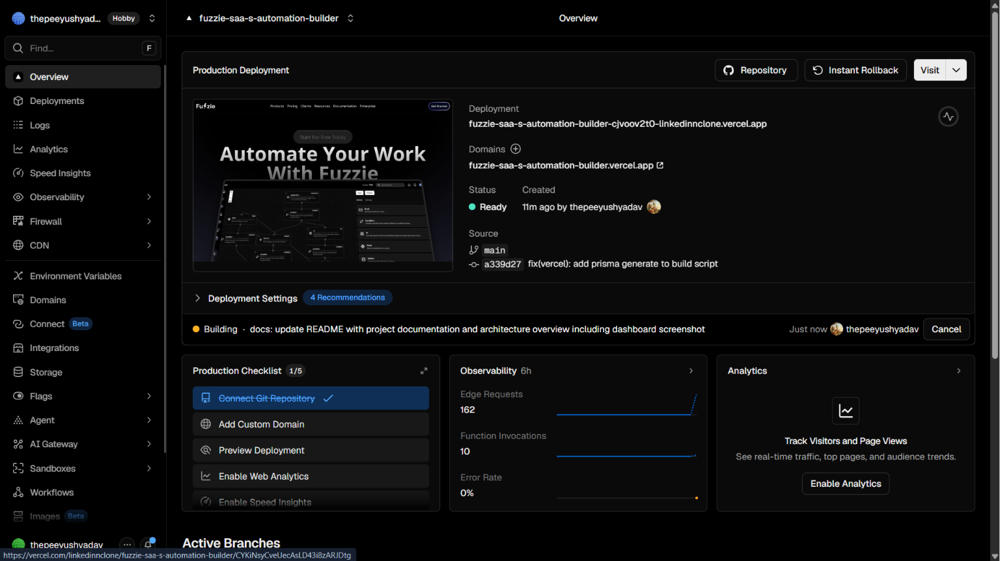
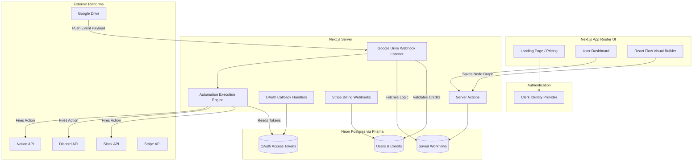

<div align="center">
  
  
  
  
  
  
  
  
</div>

<h1 align="center">Fuzzie - Enterprise SaaS Automation Builder</h1>

<p align="center">
  A highly scalable, multi-tenant SaaS platform that acts as your personal automation engine. Fuzzie empowers users to connect disparate web applications (Google Drive, Notion, Slack, Discord) and create powerful, real-time automated workflows using a stunning visual node editor—comparable to industry giants like Zapier or Make.com.
</p>

<p align="center">
  <strong>🔴 Live Demo:</strong> <a href="https://fuzzie-saa-s-automation-builder.vercel.app/" target="_blank">https://fuzzie-saa-s-automation-builder.vercel.app/</a>
</p>

<br />

<div align="center">
  
  
</div>

<br />

---

## 🌟 Comprehensive Feature Breakdown

Fuzzie is not just an interface; it is a complete backend event-processing engine built for production. 

### 1. Visual Automation Canvas (React Flow)
* **Infinite Drag & Drop Canvas:** Built on top of `reactflow`, users can drag integration nodes onto an infinite grid to design their workflow logic.
* **Custom Nodes & Edges:** Specifically designed UI for each integration (Triggers and Actions) with custom connection pathways.
* **Real-time State Management:** Utilizes **Zustand** alongside React Context to instantly reflect canvas changes, saving node positioning and connection states to the database securely.

### 2. Powerful Integrations & Webhooks
* **Google Drive (Trigger):** Automatically listens to user's Google Drive via secure push-webhooks. Whenever a file is created or modified, Fuzzie catches the payload and triggers the associated automation.
* **Slack (Action):** Authenticated via Slack OAuth. Fuzzie can dynamically push messages to specific Slack channels based on upstream data.
* **Discord (Action):** Discord Bot integration allows Fuzzie to post real-time alerts into designated Discord servers.
* **Notion (Action):** Connects to Notion workspaces to automatically append new items, pages, or data entries into Notion Databases.

### 3. Enterprise-Grade Authentication & Security
* **Clerk Integration:** Complete user lifecycle management including Secure Sign-In, Sign-Up, password recovery, and session management.
* **OAuth2 Flows:** Secure, custom-built token exchange flows for users granting access to their third-party apps (Google, Slack, etc.). Tokens are stored securely in the Postgres database.

### 4. Billing, Subscriptions & Credits
* **Stripe Payment Gateway:** Integrated checkout sessions using Stripe.
* **Tiered Subscriptions:** Handles different pricing tiers (Free, Pro, Unlimited) with recurring billing.
* **Credit Tracking System:** Each workflow execution burns a "credit". The platform actively tracks credits per user, gating executions if limits are reached, and dynamically updating via Stripe webhooks upon subscription upgrades.

### 5. Beautiful & Modern UI/UX
* **Aceternity UI & Framer Motion:** The landing page features state-of-the-art 3D hover effects, animated glowing backgrounds, and smooth scroll transitions.
* **Shadcn UI + Tailwind CSS:** A fully accessible, dark-mode-first component library ensuring a premium, unified aesthetic across all dashboards, modals, and forms.
* **UploadCare:** Integrated dropzones for seamless and optimized file uploads.

---

## 🏗️ System Architecture & Data Flow

Fuzzie relies entirely on Next.js Server Actions for client-to-database mutations and Edge API routes for receiving high-throughput webhooks.



---

## 🛠️ Complete Technology Stack

| Domain | Technology Used |
| :--- | :--- |
| **Framework** | Next.js 14 (App Router, Server Components) |
| **Language** | TypeScript |
| **Visual Node Editor** | React Flow |
| **Database** | Neon Serverless Postgres |
| **ORM** | Prisma |
| **Authentication** | Clerk |
| **Payments** | Stripe |
| **Styling & UI** | Tailwind CSS, Shadcn UI, Aceternity UI, Lucide React |
| **Animations** | Framer Motion |
| **State Management**| Zustand, React Context API |
| **Forms & Validation**| React Hook Form, Zod |
| **File Storage** | UploadCare |

---

## 🚀 Getting Started (Local Development)

### Prerequisites
* **Node.js** (v18+) or **Bun**
* A **NeonDB** (Postgres) connection string
* Developer accounts for **Clerk, Stripe, Google Cloud, Notion, Slack, Discord**
* **Ngrok** (crucial for local webhook testing)

### 1. Clone & Install
```bash
git clone https://github.com/your-username/fuzzie-app.git
cd fuzzie-app
bun install
```

### 2. Environment Variables
Create a `.env` file in the root. You must configure the following parameters (refer to a `.env.example` if needed):
* `DATABASE_URL` (Neon Postgres)
* Clerk Secret and Publishable Keys
* Stripe Secret Key and Webhook Secret
* OAuth Client IDs & Secrets for Google, Slack, Discord, Notion
* `NEXT_PUBLIC_URL` (usually `http://localhost:3000`)
* `NGROK_URI` (your ngrok forwarding URL for webhooks)

### 3. Database Initialization
Push the Prisma schema to your Postgres instance and generate the client:
```bash
bunx prisma generate
bunx prisma db push
```

### 4. Run the Servers
To develop locally and test actual triggers from Google Drive, you need two terminals:

**Terminal 1 (Next.js):**
```bash
bun run dev
```
**Terminal 2 (Ngrok):**
```bash
ngrok http 3000
```
*Note: Ensure your Google Drive webhook subscriptions point to your `https://<ngrok-id>.ngrok-free.app/api/drive-activity/notification` endpoint.*

---

## 🌍 Deployment

Fuzzie is optimized for deployment on **Vercel**. 

1. Push your code to GitHub.
2. Import the project in Vercel.
3. Vercel will automatically detect Next.js. 
4. **Crucial:** Ensure your build script in `package.json` runs Prisma generation to prevent caching errors:
   `"build": "prisma generate && next build"`
5. Paste all your environment variables into Vercel settings.
6. Deploy.
7. Update all your OAuth redirect URIs in Google, Slack, Discord, and Notion developer consoles to your new `https://your-app.vercel.app` domain.

---

### ✍️ Built & Maintained By
**Piyush Yadav**
