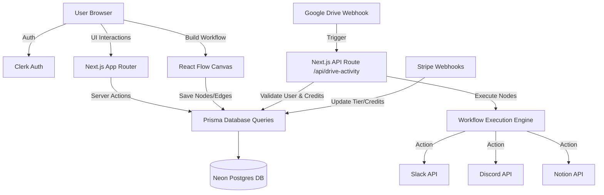

<div align="center">
  
  
  
  
  
  
</div>

<h1 align="center">Fuzzie - SaaS Automation Builder</h1>

<p align="center">
  A powerful, multi-tenant SaaS automation platform (similar to Zapier) that allows users to create visual, drag-and-drop workflows connecting their favorite apps like Google Drive, Notion, Slack, and Discord.
</p>

<br />

<div align="center">
  
</div>

<br />

---

### 🚀 Technology Highlight
*(A high-level overview of the modern tech stack powering Fuzzie)*

🔥 **A Full Stack SaaS Application Built with:** 
🟦 **Next.js 14 (App Router, Server Actions, API Routes)** 
🟡 **TypeScript** 
🟩 **Prisma ORM** 
🐘 **Neon Serverless Postgres** 
🔐 **Clerk (Authentication)** 
🎨 **Tailwind CSS, Shadcn UI & Aceternity UI** 
💳 **Stripe (Payments & Billing)** 
🌐 **React Flow (Visual Node Editor)**
☁️ **UploadCare (File Management)**

---

### ⚡ Project Overview

Fuzzie is a robust SaaS workflow automation platform designed to save time by connecting different web apps seamlessly. Users can build complex automations using a beautiful, interactive node-based visual editor.

**Key Capabilities:**
* Create complex, multi-step **Automations & Workflows** using a drag-and-drop canvas.
* Connect external accounts via robust **OAuth2 Integrations**.
* **Supported Integrations:** 
  * 📁 **Google Drive** (File creation/modification triggers)
  * 💬 **Slack** (Send channel messages)
  * 🎮 **Discord** (Send server messages)
  * 📝 **Notion** (Create database items)
* Manage active connections and view workflow execution logs.
* Process payments, manage subscription tiers, and track API credits via an integrated **Stripe** billing portal.
* Beautiful, dark-mode first UI using **Aceternity UI** and **Shadcn**.

---

### 🏗️ Detailed Project Architecture

Fuzzie relies heavily on Next.js Server Components, Server Actions, and Background API Webhooks for real-time automation execution.

#### Architecture Diagram



#### Data Flow Explained
The platform handles two main complex flows: Building Workflows and Executing Automations.

1. **Building Workflows (React Flow):**
   - **Client:** The user drags integration nodes (e.g., Google Drive Trigger, Slack Action) onto the canvas.
   - **State:** Zustand manages the local state of nodes and edges.
   - **Server (Action):** Upon clicking save, a Server Action processes the JSON representation of the nodes and securely saves them to Neon Postgres via Prisma.

2. **Executing Automations (Webhooks):**
   - **Trigger:** A third-party app (e.g., Google Drive) sends a webhook payload to a public Next.js API route when an event occurs (e.g., new file created).
   - **Verification:** The API route verifies the user's Clerk ID and checks if they have sufficient automation credits.
   - **Execution:** The server retrieves the user's saved workflow from the database, parses the steps, and sequentially fires outgoing API requests to the connected services (Slack, Discord, Notion).

---

### 📂 Key Features & Directory Structure

🔑 **Core Modules:**

* `src/app/page.tsx`: **Public Landing Page** - Stunning animated landing page featuring Aceternity UI 3D cards and pricing tables.
* `src/app/(main)/(pages)/dashboard`: **User Dashboard** - Overview of active workflows, connected integrations, and credit usage.
* `src/app/(main)/(pages)/connections`: **Integration Hub** - OAuth connection management for Discord, Google, Notion, and Slack.
* `src/app/(main)/(pages)/workflows/editor/[editorId]`: **Visual Automation Editor** - The core workspace where users build their logic using `reactflow`.
* `src/app/api/auth/callback/[service]`: **OAuth Callbacks** - Secure endpoints handling token exchanges for third-party integrations.
* `src/app/api/drive-activity/notification`: **Webhook Listener** - The main entry point that listens to Google Drive changes and triggers user workflows.
* `src/components/global`: **Shared UI** - Custom modals, navigation, and info bars used across the application.

---

### ⚙️ Getting Started / How to Run

Follow these instructions to get a copy of the project up and running on your local machine.

*Prerequisites:*
* **Bun** or **Node.js** (v18+)
* **NeonDB** (or any Postgres Database)
* **Clerk Account** (For Auth)
* **Stripe Account** (For Billing)
* **Ngrok** (For testing local webhooks)
* **Developer Accounts** for Google, Slack, Discord, and Notion (For OAuth apps)

#### Local Development Setup

1. **Clone the repository:**
   ```bash
   git clone https://github.com/your-username/fuzzie-app.git
   cd fuzzie-app
   ```

2. **Install dependencies:**
   ```bash
   bun install
   ```

3. **Initialize Environment Variables:**
   Create a `.env` file in the root directory. You will need to populate it with database URLs, Clerk keys, Stripe secrets, and OAuth Client IDs for all integrations.

4. **Initialize the Database:**
   ```bash
   bunx prisma generate
   bunx prisma db push
   ```

5. **Start the development server:**
   ```bash
   bun run dev
   ```

The application will be running on `http://localhost:3000`.

*(Note: To test automations locally, you must run `ngrok http 3000` and use the ngrok URL as your webhook destination in your Google/Stripe developer consoles).*

---

### ✍️ Built By
This software is developed and managed by **Piyush Yadav**.
